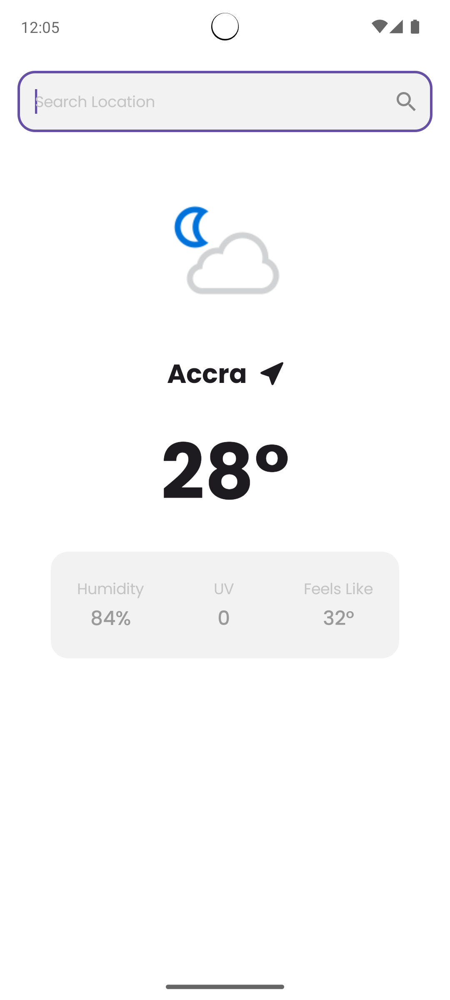
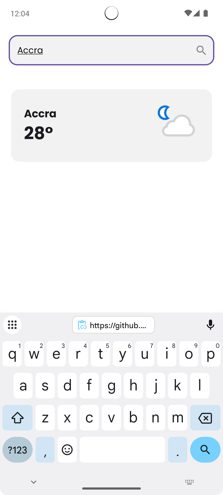

# Weatherly 🌦️
**Weatherly** is a modern and user-friendly weather app for Android, built with **Jetpack Compose**. It allows users to search for and view real-time weather information, including temperature, humidity, UV index, and "feels like" temperature. Designed with clean architecture and best practices, it delivers a smooth and engaging experience.
[](https://kotlinlang.org)
---

## Table of Contents

1. [Features](#features)
2. [Tech Stack](#tech-stack)
3. [Setup Instructions](#setup-instructions)
4. [Running the Project](#running-the-project)
5. [Screenshots](#screenshots)
6. [License](#license)

---

## Features 🚀

- **🌤 Real-time Weather Updates**: Fetch real-time weather data for any city.
- **🔍 City Search**: Search for weather data based on the city name.
- **📊 Data Persistence**: Local caching of weather data using **DataStore**.
- **⚡ Fast and Modern UI**: Built with Jetpack Compose for a fluid user experience.
- **🔧 Clean Architecture**: Decoupled components for better maintainability and testing.

---

## Tech Stack 🛠

The project uses the following technologies:

- **Jetpack Compose**: Declarative UI framework for Android.
- **Ktor**: HTTP client for fetching weather data from a REST API.
- **Koin**: Lightweight dependency injection framework.
- **Kotlin Serialization**: For JSON serialization and deserialization.
- **DataStore Preferences**: For local persistence of data.
- **Coil**: Image loading library for displaying weather icons.

---

## Setup Instructions ⚙️

### Prerequisites:
- **Android Studio**.
- **JDK**: Java 11 or later.
- **API Key**: Obtain a free API key from [Weatherapi](https://www.weatherapi.com).

---

### Step 1: Clone the Repository
Clone the Weatherly project to your local machine:

```bash
git clone https://github.com/norrisboat/Weatherly.git
cd Weatherly
```

---

### Step 2: Build and Run

1. Open the project in **Android Studio**.
2. Connect an Android device or launch an emulator.
3. Build and run the project:
    - Use the "Run" button in Android Studio (**▶️**) or run the following Gradle command:

   ```bash
   ./gradlew assembleDebug
   ```

---

## Screenshots 📱

| Home Screen                | City Search                 |
|----------------------------|-----------------------------|
|  |  |

---

## License 📄

This project is licensed under the **MIT License** - see the [LICENSE](LICENSE) file for details.

---

Happy Coding! 🚀
